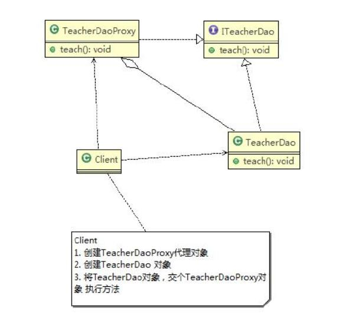
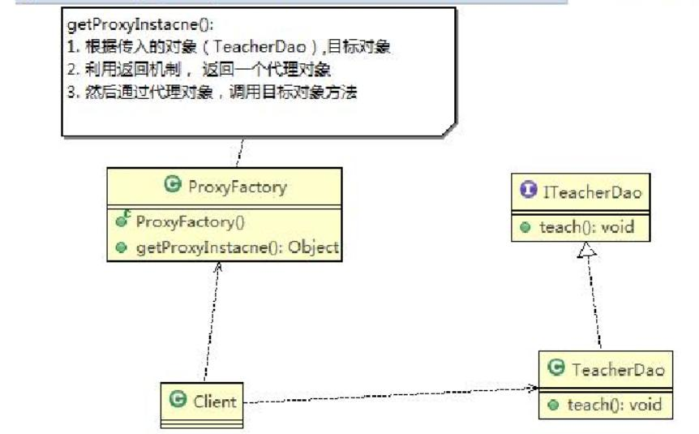
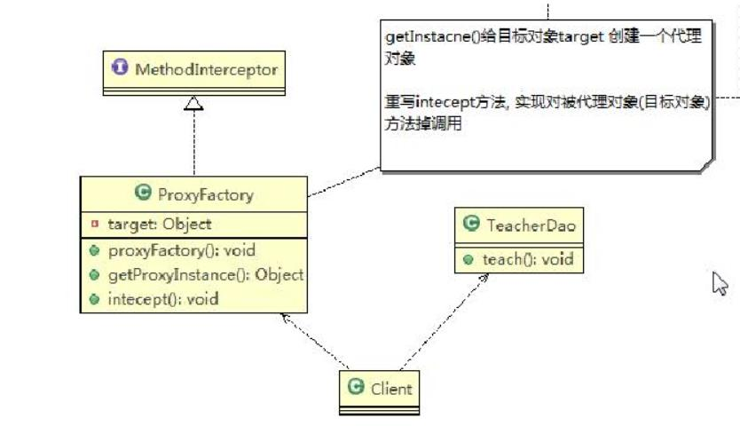

# 静态代理
- 模式图

- 粘出主要代码，很简单，代理类和被代理类实现相同的接口，代理类聚合了被代理实例，在代理类的方法内部调用被代理对象相同的方法
```
//创建目标对象(被代理对象)
		TeacherDao teacherDao = new TeacherDao();
		
		//创建代理对象, 同时将被代理对象传递给代理对象
		TeacherDaoProxy teacherDaoProxy = new TeacherDaoProxy(teacherDao);
		
		//通过代理对象，调用到被代理对象的方法
		//即：执行的是代理对象的方法，代理对象再去调用目标对象的方法 
		teacherDaoProxy.teach();
```

# 动态代理
## JDK动态代理
- 模式图

```
public class ProxyFactory {

	//维护一个目标对象 , Object
	private Object target;

	//构造器 ， 对target 进行初始化
	public ProxyFactory(Object target) {
		
		this.target = target;
	} 
	
	//给目标对象 生成一个代理对象
	public Object getProxyInstance() {		
		//说明
		/*
		 *  public static Object newProxyInstance(ClassLoader loader,
                                          Class<?>[] interfaces,
                                          InvocationHandler h)                                          
            //1. ClassLoader loader ： 指定当前目标对象使用的类加载器, 获取加载器的方法固定
            //2. Class<?>[] interfaces: 目标对象实现的接口类型，使用泛型方法确认类型
            //3. InvocationHandler h : 事情处理，执行目标对象的方法时，会触发事情处理器方法, 会把当前执行的目标对象方法作为参数传入
		 */
		return Proxy.newProxyInstance(target.getClass().getClassLoader(), 
				target.getClass().getInterfaces(), 
				new InvocationHandler() {
					
					@Override
					public Object invoke(Object proxy, Method method, Object[] args) throws Throwable {
						// TODO Auto-generated method stub
						System.out.println("JDK代理开始~~");
						//反射机制调用目标对象的方法
						Object returnVal = method.invoke(target, args);
						System.out.println("JDK代理提交");
						return returnVal;
					}
				}); 
	}
}
```
特点：这里主要采用了JDK内部的一个方法Proxy.newProxyInstance。对new InvocationHandler()中invoke方法的重写就实现的代理方法的实现。这种代理
方式要求被代理对象必须实现接口，这也是其与Cglib代理方式最大的区别。

## Cglib代理
- 模式图

```
public class ProxyFactory implements MethodInterceptor {

	//维护一个目标对象
	private Object target;
	
	//构造器，传入一个被代理的对象
	public ProxyFactory(Object target) {
		this.target = target;
	}

	//返回一个代理对象:  是 target 对象的代理对象
	public Object getProxyInstance() {
		//1. 创建一个工具类
		Enhancer enhancer = new Enhancer();
		//2. 设置父类
		enhancer.setSuperclass(target.getClass());
		//3. 设置回调函数
		enhancer.setCallback(this);
		//4. 创建子类对象，即代理对象
		return enhancer.create();		
	}	

	//重写  intercept 方法，会调用目标对象的方法
	@Override
	public Object intercept(Object arg0, Method method, Object[] args, MethodProxy arg3) throws Throwable {
		// TODO Auto-generated method stub
		System.out.println("Cglib代理模式 ~~ 开始");
		Object returnVal = method.invoke(target, args);
		System.out.println("Cglib代理模式 ~~ 提交");
		return returnVal;
	}
}
```
特点：这种代理方式并不要求被代理对象实现接口，要实现这种方式必须有这几个jar包。
[](D:/github_git/BabyLaugh/学习资料/JAVA/java常用设计模式/设计模式-尚硅谷/代码/DesignPattern/src/com/atguigu/proxy/cglib/cglib-2.2.jar)
[](D:/github_git/BabyLaugh/学习资料/JAVA/java常用设计模式/设计模式-尚硅谷/代码/DesignPattern/src/com/atguigu/proxy/cglib/asm.jar)
[](D:/github_git/BabyLaugh/学习资料/JAVA/java常用设计模式/设计模式-尚硅谷/代码/DesignPattern/src/com/atguigu/proxy/cglib/asm-commons.jar)
[](D:/github_git/BabyLaugh/学习资料/JAVA/java常用设计模式/设计模式-尚硅谷/代码/DesignPattern/src/com/atguigu/proxy/cglib/asm-tree.jar)
