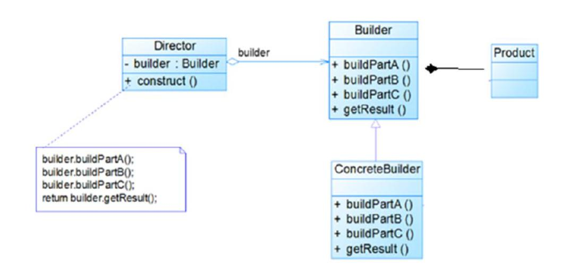

## 模式图

## 建造者的四个角色
- 产品，封装了要产出产品的细节要素；
- 抽象建造者，可以是接口或抽象类，可通过组合或聚合等方式依赖产品实例。同时封装了具体建造细节（方法）；
- 具体建造者，实现或继承抽象建造者，重写抽象方法实现每步具体建造细节；
- 指挥者，面向抽象建造者编程，可通过聚合方式依赖具体的建造者，调用（指挥）建造者方法创建产品；
## 代码示例
```
/* 产品类(也可以是接口) */
public class House {
	//封装了要产出产品的细节要素；
	private String baise;
	private String wall;
	private String roofed;
	......
}
/* 抽象建造者 */
public abstract class HouseBuilder {
	//通过组合方式依赖产品实例
	protected House house = new House();
	
	//将建造的流程写好, 封装了具体建造细节
	public abstract void buildBasic();
	public abstract void buildWalls();
	public abstract void roofed();
	
	//建造房子好， 将产品(房子) 返回
	public House buildHouse() {
		return house;
	}
}
/* 具体建造者 */
public class CommonHouse extends HouseBuilder {
	//重写抽象方法实现每步具体建造细节
	@Override
	public void buildBasic() {
		// TODO Auto-generated method stub
		System.out.println(" 普通房子打地基5米 ");
	}
	@Override
	public void buildWalls() {
		// TODO Auto-generated method stub
		System.out.println(" 普通房子砌墙10cm ");
	}
	@Override
	public void roofed() {
		// TODO Auto-generated method stub
		System.out.println(" 普通房子屋顶 ");
	}
}
/* 指挥官 */
public class HouseDirector {
	//面向抽象建造者编程
	HouseBuilder houseBuilder = null;

	//构造器传入 houseBuilder
	public HouseDirector(HouseBuilder houseBuilder) {
		this.houseBuilder = houseBuilder;
	}

	//通过setter 传入 houseBuilder
	public void setHouseBuilder(HouseBuilder houseBuilder) {
		this.houseBuilder = houseBuilder;
	}
	
	//调用（指挥）建造者方法创建产品
	public House constructHouse() {
		houseBuilder.buildBasic();
		houseBuilder.buildWalls();
		houseBuilder.roofed();
		return houseBuilder.buildHouse();
	}	
}
```
## 建造者模式的特点
- 将产品与建造者解耦，产品与建造者直接可以用多种方式关联（聚合、组合甚至继承），这样可以实现相同的方式实现不同产品的创建。但是如果产品之间的同质化不高无法使用相同的创建过程，则不适用建造者模式；
- 方便扩增建造者。因为指挥者面向抽象建造者编程；
- 抽象工厂模式VS建造者模式。简单来讲他们解决的问题是不同的，抽象工厂模式解决根据具体条件创建哪个实例，而建造者模式解决具体这个实例如何创建。例如某个工厂要创建普通房子，这个创建过程可以交给某个指挥者去完成，指挥者根据条件聚合具体的建造者并指挥建造者完成普通房子的建造工作，再将创建好的实例返回工厂调用方。