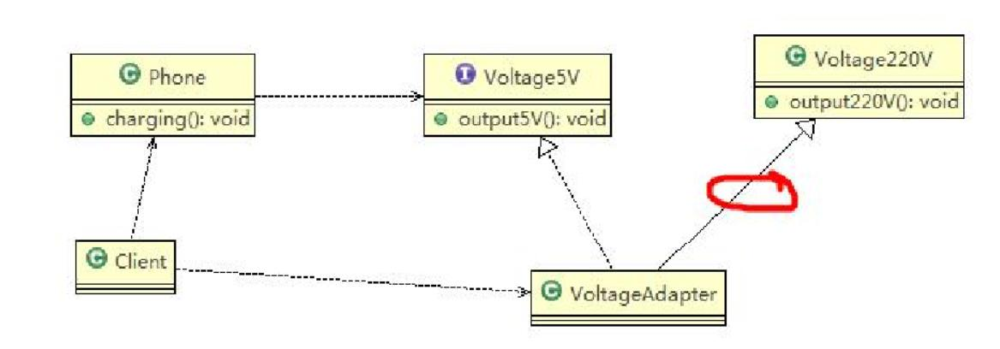
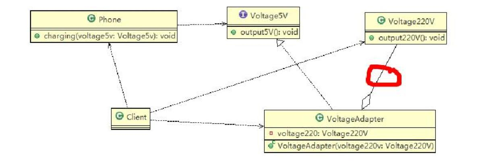
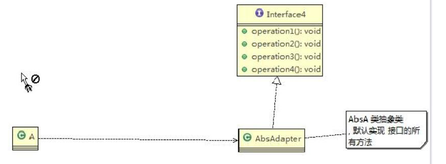
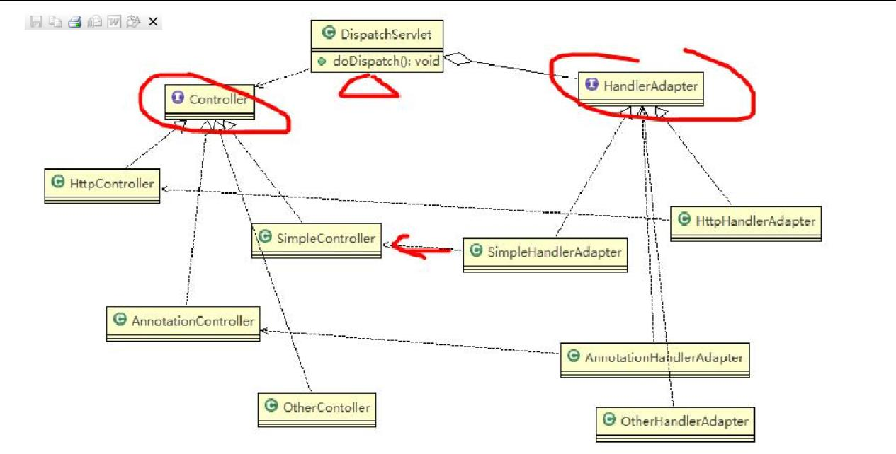

# 基本概念
- A接口无法直接调用B接口，那么就新增C接口，A调用C接口，在C接口的内部再调用B接口，从而实现A接口对B接口的间接调用，A接口面向C接口编程。
- 三大元素:调用方、适配器、被适配方

# 类适配器模式
- 
- 说明：类适配器的特点在于适配器继承了被适配的类。图中，类Phone无法直接使用Voltage220V中的方法output220()方法，适配器VoltageAdapter继承Voltage220V后在内部调用output220()方法获取电源，类Phone调用适配器VoltageAdapter中的output5V()方法从而实现类Phone对类Voltage220V的间接使用；
- 代码展示
```
/* 被适配的类 */
public class Voltage220V {
	//输出220V的电压
	public int output220V() {
		int src = 220;
		System.out.println("电压=" + src + "伏");
		return src;
	}
}
/* 适配器接口 */
public interface IVoltage5V {
	public int output5V();
}
/* 适配器实现类 */
public class VoltageAdapter extends Voltage220V implements IVoltage5V {
	@Override
	public int output5V() {
		// TODO Auto-generated method stub
		//获取到220V电压
		int srcV = output220V();
		int dstV = srcV / 44 ; //转成 5v
		return dstV;
	}
}
/* 调用方 */
public class Phone {
	//充电
	public void charging(IVoltage5V iVoltage5V) {
		if(iVoltage5V.output5V() == 5) {
			System.out.println("电压为5V, 可以充电~~");
		} else if (iVoltage5V.output5V() > 5) {
			System.out.println("电压大于5V, 不能充电~~");
		}
	}
}
```

# 对象适配器
- 
- 说明：对象适配器的特点在于适配器通过聚合而非继承的方式依赖被适配的类。
- 代码展示,与类适配器的区别仅在于适配器实现类的代码上
```
/* 适配器实现类 */
public class VoltageAdapter  implements IVoltage5V {
	private Voltage220V voltage220V; // 关联关系-聚合	
	//通过构造器，传入一个 Voltage220V 实例
	public VoltageAdapter(Voltage220V voltage220v) {
		
		this.voltage220V = voltage220v;
	}
	@Override
	public int output5V() {		
		int dst = 0;
		if(null != voltage220V) {
			int src = voltage220V.output220V();//获取220V 电压
			System.out.println("使用对象适配器，进行适配~~");
			dst = src / 44;
			System.out.println("适配完成，输出的电压为=" + dst);
		}		
		return dst;		
	}
}
```

# 接口适配器
- 
- 说明：接口适配器的特点在于适配器具体实现类和适配器接口之间的关系发生变化，适配器与被适配类的关系不变。适配器具体实现类没有真正实现适配器接口的所有方法，而采用空实现的方式。当调用方调用适配器实现类的具体方法时采用匿名内部类的方式对所关心的方法重写，由调用方来具体实现适配代码。
- 代码示例
```
/* 适配器接口 */
public interface Interface4 {
	public void m1();
	public void m2();
	public void m3();
	public void m4();
}
/* 适配器实现类 */
public abstract class AbsAdapter implements Interface4 {
	/* 空实现 */
	public void m1() {

	}
	public void m2() {

	}
	public void m3() {

	}
	public void m4() {

	}
}
/* 调用方 */
public class Client {
	public static void main(String[] args) {		
		AbsAdapter absAdapter = new AbsAdapter() {
			//只需要去覆盖我们 需要使用 接口方法
			@Override
			public void m1() {
				// TODO Auto-generated method stub
				System.out.println("使用了m1的方法");
			}
		};
		
		absAdapter.m1();
	}
}
```

# springMVC中适配器的代码刨析
- 
- 说明：调用方DispatchServlet，被调用方Controller,适配器HandlerAdatper。每一个Controller都有一个对应的HandlerAdapter,DispatchServlet在获取request信息后通过循环遍历方式找到对应的HandlerAdapter，然后在调用HandlerAdapter的handle方法实现对指定Controller的调用；